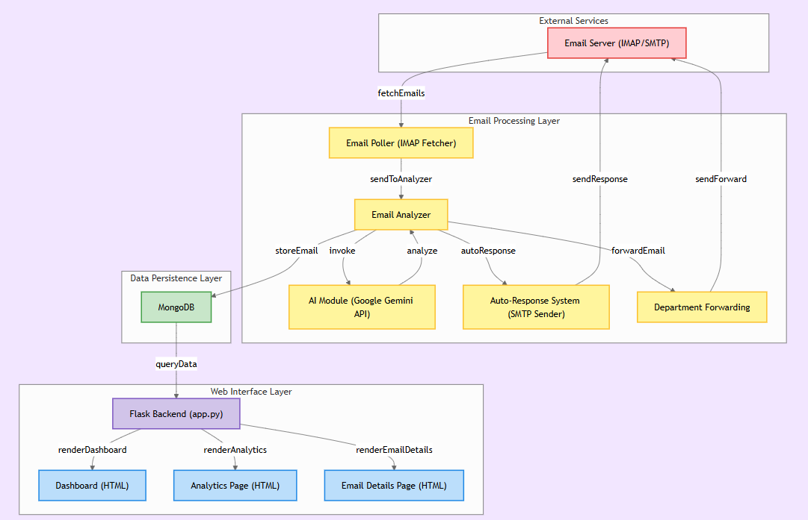

# ViewZen Smart Email Management System

## Overview

The Smart Email Management System is an AI-powered solution designed to automate email handling, categorization, and response management. The system uses artificial intelligence to classify incoming emails, prioritize them, generate appropriate responses, and forward them to the relevant departments.

## Key Features

- **Automated Email Processing**: Fetches and processes unread emails from a designated inbox
- **AI-Powered Categorization**: Classifies emails into Technical, Billing, Complaint, and General Inquiry categories
- **Sentiment Analysis**: Determines customer sentiment from email content
- **Priority Assignment**: Assigns priority levels (1-5) based on content urgency and sentiment
- **Smart Forwarding**: Automatically forwards emails to the appropriate department
- **Auto-Response Generation**: Creates personalized, contextually relevant responses for common inquiries
- **Email Summarization**: Generates concise summaries for long emails
- **Multi-language Support**: Detects email language for better processing
- **Comprehensive Dashboard**: Web interface to manage, track, and respond to emails
- **Analytics**: Visual reports on email volumes, response times, and other metrics

## Technologies Used

- **Python**: Core programming language
- **Flask**: Web framework for the dashboard
- **MongoDB**: Database for storing emails and response data
- **Google Gemini AI**: For AI-based text analysis and generation
- **IMAP/SMTP**: For email fetching and sending
- **HTML/CSS**: For the web interface
- **Tailwind and Bootstrap**: For User Interface components and styling

## Architecture Flow Diagram


## Setup Instructions

### Prerequisites

- Python 3.8+
- MongoDB
- Google Gemini API access

### Environment Variables

Create a `.env` file with the following variables:

```
EMAIL_USER=your_email@gmail.com
EMAIL_PASS=your_email_password
GEMINI_API_KEY=your_gemini_api_key

DATABASE_URL=your_mongodb_connection_string

TECH_EMAIL=technical_department@example.com
BILLING_EMAIL=billing_department@example.com
COMPLAINT_EMAIL=complaints@example.com
GENERAL_EMAIL=info@example.com
```

### Installation

1. Clone the repository:
   ```
   git clone https://github.com/yourusername/smart-email-management.git
   cd smart-email-management
   ```

2. Install required packages:
   ```
   pip install -r requirements.txt
   ```

3. Start the application:
   ```
   python app.py
   ```

## Usage

1. **Dashboard**: Access the main dashboard at `http://localhost:5000/`
   - View emails categorized by department
   - Check email details, sentiment, and priority

2. **Analytics**: View email analytics at `http://localhost:5000/analytics`
   - Weekly report of email volumes
   - Response statistics
   - Category distribution

3. **Email Details**: Access detailed email information by clicking on an email
   - View full message content
   - Send/view responses
   - Change status or category

## API Endpoints

- `/api/weekly-report`: Get weekly email statistics
- `/api/response-stats`: Get response time statistics 
- `/api/email-details/<email_id>`: Get detailed information about a specific email

## How It Works

1. The system polls the email inbox at regular intervals for unread messages
2. Each email is analyzed for:
   - Category (Technical, Billing, etc.)
   - Sentiment (Positive, Neutral, Negative, Very Negative)
   - Priority (1-5)
   - Language
   - Customer ID

3. The email is then forwarded to the appropriate department with enhanced metadata
4. For eligible emails, an auto-response is generated and sent to the customer
5. All email data is stored in MongoDB for tracking and analytics
6. The web dashboard provides an interface for managing and responding to emails

## Security Considerations

- Ensure proper email account security with 2FA
- Store sensitive environment variables securely
- Implement proper access controls for the dashboard
- Consider encrypting sensitive customer data in the database

## Future Enhancements

- Integration with ticketing systems
- Enhanced machine learning models for better categorization
- Mobile app for on-the-go email management
- Customer history tracking
- SLA monitoring and alerts

## License

This project is licensed under the MIT License - see the LICENSE file for details.
